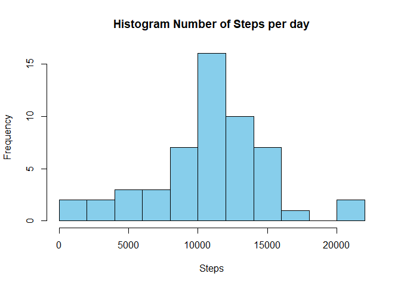
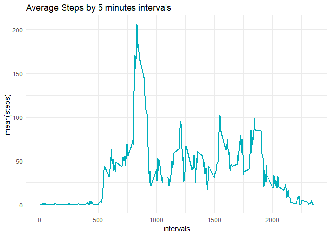
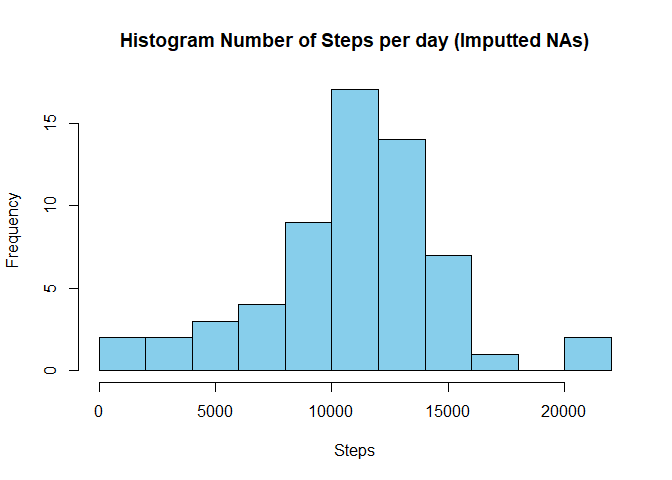
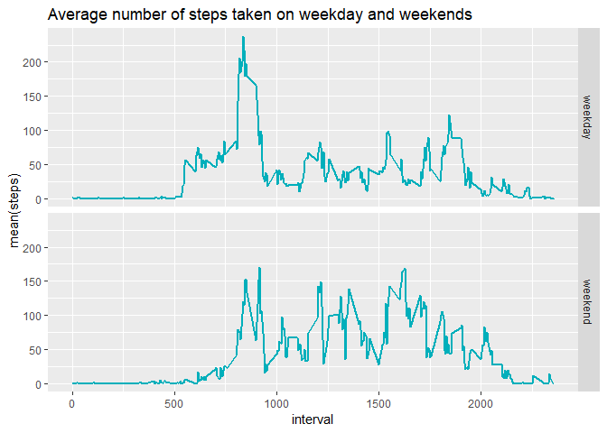

```
## Loading required package: knitr
```

## Introduction

This Project goal is to document the analysis done over the data set *Activity Monitoring Data* 
(available at [https://d396qusza40orc.cloudfront.net/repdata%2Fdata%2Factivity.zip])

The variables included in this dataset are:

* **steps   :** Number of steps taking in a 5-minute interval (missing values are coded as **NA**)
* **date    :** The date on which the measurement was taken in YYYY-MM-DD format
* **interval:** identifier for the 5-minute interval in which measurement was taken

The dataset is stored in a comma-separated-value (CSV) file and there are a total of 17,568 observations in this dataset.


## Loading and preprocessing the data

The *Activity Monitoring Data* ZIP file is also included as part of the repository in GitHub.

The first thing to do is to extract the CSV file into a data frame. The following code will assume that the ZIP file has already been downloaded, named *activity.zip* and placed on the curent R work directory.


```r
unzip("activity.zip", overwrite = TRUE, junkpaths = FALSE, exdir = ".")
mydata <- read.csv("./activity.csv", header=TRUE)
```

By looking at the strcuture of the data frame we can notice that the date column is a factor


```r
str(mydata)
```

```
## 'data.frame':	17568 obs. of  3 variables:
##  $ steps   : int  NA NA NA NA NA NA NA NA NA NA ...
##  $ date    : Factor w/ 61 levels "2012-10-01","2012-10-02",..: 1 1 1 1 1 1 1 1 1 1 ...
##  $ interval: int  0 5 10 15 20 25 30 35 40 45 ...
```

To facilitate the analysis we will now perform a couple of transformations over the data:

* Convert the **date** variable to a date class
* Add a new column with the name of the week day
* Add a new column with the month number


```r
mydata$date <- as.Date(as.character(mydata$date), "%Y-%m-%d")
mydata$daytype <- weekdays(mydata$date, abbreviate= FALSE)
mydata$Month <- format(mydata$date,"%m")
```


## What is mean total number of steps taken per day?

To quickly analyze the data and get some understanding of the number of steps that were taken per day let's start by calculating the total number of steps and producing an histogram.


```r
totstp <- aggregate(steps ~ date, mydata, sum)
hist(totstp$steps, breaks="FD", col = "sky blue", xlab="Steps", main="Histogram Number of Steps per day")
```

<!-- -->

Finally let's take a look to the *mean* and *median* values of the daily number of steps


```r
mean(totstp$steps)
```

```
## [1] 10766.19
```

```r
median(totstp$steps)
```

```
## [1] 10765
```


## What is the average daily activity pattern?

To understand the daily activity pattern, let's look at a series plot of the 5 -minute interval (x-axis) and the average number of steps taken, averaged across all days (y-axis)


```r
require(ggplot2)
require(dplyr)

stpavg <- mydata %>% group_by(interval) %>% summarize(stepsmean=mean(steps,na.rm=TRUE))
ggplot(stpavg, aes(x= interval, y=stepsmean), fill= "#00AFBB") + geom_line(size = 1, colour= "#00AFBB") + labs(title="Average Steps by 5 minutes intervals",x ="intervals", y = "mean(steps)") +theme_minimal()
```

<!-- -->
 
The graph gives us an idea of where the highest average of steps is in all the days, but to be more precise let's get the maximum interval directly:


```r
stpavg[which(stpavg$stepsmean == max(stpavg$stepsmean)),]
```

```
## # A tibble: 1 x 2
##   interval stepsmean
##      <int>     <dbl>
## 1      835      206.
```


## Imputing missing values

Let's review how many missing values we have in the steps variable and the percentage of all the observations they represent:


```r
sum(is.na(mydata$steps))
```

```
## [1] 2304
```

```r
sum(is.na(mydata$steps))/length(mydata$steps)
```

```
## [1] 0.1311475
```

We have about 13% of missing values, which seems as a significative number.

For the next part of the analysis we need to devise a strategy to impute the missing values. The strategy we will implement is based on applying the mean over the steps values of the same month, week day and interval, when applying the mean function we also trimmed the values removing the top and bottom 10% of the values (trimmed mean).


```r
stpavg <- mydata %>% group_by(interval,daytype,Month) %>% summarize(stepsmean=mean(steps,na.rm=TRUE,trim=0.1))
```

Now we will create a new data frame, merging the original data with the newly created **stpavg** that contains the trimmed mean value, and then replacing the **NA** values for the *stepsmean* value.


```r
activity <- merge(mydata,stpavg,by.x=c("interval","daytype","Month"), by.y=c("interval","daytype","Month"))
activity <- cbind(activity[c("interval","daytype","Month","date")], "steps"=with(activity, ifelse(is.na(steps), stepsmean, steps)))
```

Let's check the structure and **NA** values of the new data frame:


```r
str(activity)
```

```
## 'data.frame':	17568 obs. of  5 variables:
##  $ interval: int  0 0 0 0 0 0 0 0 0 0 ...
##  $ daytype : chr  "Friday" "Friday" "Friday" "Friday" ...
##  $ Month   : chr  "10" "10" "10" "10" ...
##  $ date    : Date, format: "2012-10-05" "2012-10-19" ...
##  $ steps   : num  0 0 0 0 0 ...
```

```r
sum(is.na(activity))
```

```
## [1] 0
```

We will now create a histogram of the total number of steps taken each day and canculate the **mean** and **median** of total number of steps taken per day using the new data set with imputed data and draw some conlusions when comparing these values with the ones we previously calculated by ignoring the **NA** values.


```r
totstp <- aggregate(steps ~ date, activity, sum)
hist(totstp$steps, breaks="FD", col = "sky blue", xlab="Steps", main="Histogram Number of Steps per day (Imputted NAs)")
```

<!-- -->

```r
mean(totstp$steps)
```

```
## [1] 10827.17
```

```r
median(totstp$steps)
```

```
## [1] 11015
```

It looks like our imputting strategy did not introduced a significant difference in the **mean** and **median** values, the distribution of the histogram is also very similar with the highest difference in the frequency of total steps by day between the range of 12000 and 14000 steps.


## Are there differences in activity patterns between weekdays and weekends?

To address this question we will need to use the *daytype* column we have that has the day of the week name to create a new factor column that has two vales: **weekday** for days Monday through Friday and **weekend** for Saturday and Sunday.


```r
activity$dayname <- activity$daytype

activity[grep("Sunday|Saturday", activity$daytype, ignore.case = TRUE),"daytype"] <- "weekend"
activity[grep("weekend", activity$daytype, ignore.case = TRUE, invert=TRUE, value=FALSE),"daytype"] <- "weekday"

activity$daytype <- as.factor(activity$daytype)
```

Now that we have the neccesary structure in place, to answer our question, let's build a graph comparing the average number of steps taken (y-axis) on the 5-minute interval (x-axis) across weekdays or weekend days.


```r
stpavg <- activity %>% group_by(interval,daytype) %>% summarize(stepsmean=mean(steps,na.rm=TRUE))

ggplot(data=stpavg, aes(x=interval, y=stepsmean, fill="#00AFBB")) + geom_line(size=1, colour= "#00AFBB") +  
    labs(x="interval", y="mean(steps)", title="Average number of steps taken on weekday and weekends") + facet_grid(daytype~., shrink = TRUE)
```

<!-- -->

From the graph we can have an initial conclusion that:

* Up to interval 500 the average number of steps taken on weekdays and weekends is very similar
* Between intervals 500 and 1000 the average number of steps taken on weekdays is higher than on weekends
* Between intervals 1000 and 2000 the average number of steps taken on weekends is higher that on weekdays
